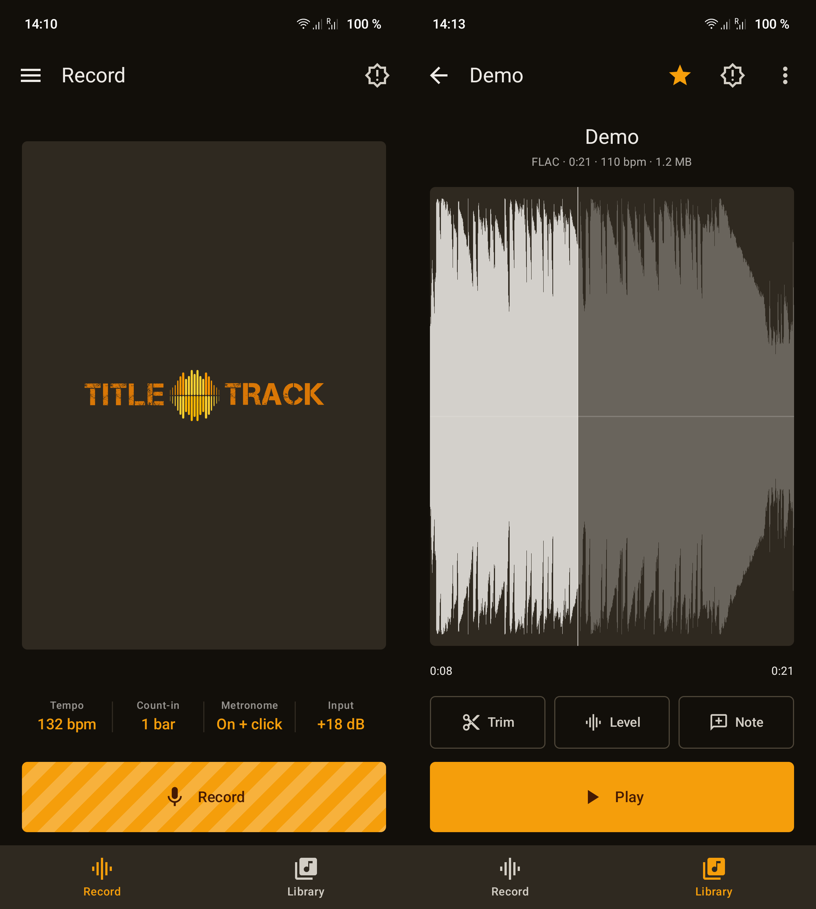

<h1>
  
  Title Track
</h1>
An Android recorder for instruments rather than for voice memos. Count yourself in at a tempo you
choose, play, and if the third bar goes wrong hit **Restart** without looking. Takes are written as
plain WAV files into a folder you pick, so they are on your phone's storage where you can easily manage them
— not locked inside the app.

Early-stage release — expect rough edges. Feedback and bug reports welcome via Issues.

## Screenshots



## Features

- **Two buttons that matter while recording** — full-width, thumb-height **Done** and **Restart**.
  Done ends the take and saves it; Restart wipes it and counts you swiftly back in.
- **Count-in** — off, one bar or two, at a tempo you set, with an accented downbeat. 
- **A live waveform while you play** — the last eight seconds as a scrolling peak envelope, the
  same shape the player draws for a finished take. Anything near full scale draws red, so clipping is visible as it
  happens.
- **Silent visual metronome** — one dot per beat under the buttons, the lit one walking the bar. Silent, and on by default for that reason — an audible click on a phone speaker ends up inside the take. **It starts with the count-in**,  so the bar is already familiar by the time you play into it.
- **A click through the take** *(optional, off)* — for headphones, where there is nothing for the
  microphone to pick up. Off by default and warned about wherever it is offered. Long-press **Metronome** on the record row to reach it. 
- **Listen before recording** *(optional, off)* — draws what the microphone hears before you press
  Record, so clipping and mic distance are settled while it still costs nothing. 
- **A level test, not a guess** — hold **Record** (or tap **Input** on the settings row) and play
  the loudest thing you are going to play. It reports the peak in dBFS and offers a gain that puts
  it at −9 dBFS, leaving room for the take to be louder than the rehearsal. 
- **Your folder, your files** — pick any folder once (`Music/Recording`, an SD card, a synced
  folder); takes land there as 44.1 kHz mono WAV. Browse it in the app, make sub-folders, rename,
  move, star, delete, share, play back. A **Starred** tab gathers the takes worth coming back to.
- **Settings that stay out of the way** — tempo, count-in and the metronome sit on one row of the
  record screen as values to read.. The settings screen itself is two tabs, split into **Recording** which is everything that shapes the next take and **System** which is the app's own set-up. 
- **English and German** — a **Language** row in Settings → System, offering the system language,
  Deutsch and English, each named in its own language. On Android 13 and up the choice *is* the
  per-app language in Android's own Settings rather than a second setting that disagrees with it.
- **Takes remember their tempo** — the bpm you played to is written into the WAV itself as a
  `LIST/INFO` comment, so it survives being copied to a computer.
- **Recorded honestly** — the least-processed microphone source the device offers
  (`UNPROCESSED` → `VOICE_RECOGNITION` → `MIC`), and unlike voice-recorders no filtering of any kind on the way to disk. Compression and limiting are absent for a different reason — clipping happens before software sees a sample, so a limiter cannot rescue it and would only cost you dynamics. Headroom is the fix. 

## The player

Tapping **a take's name** in the library opens it in the player; the **triangle** beside the name plays it
where it stands, without leaving the list. The shape here is the same one the record screen drew
while you were playing — a take looks the same afterwards as it did being made.

The player draws the take's **waveform**. A seek bar tells you where you are in a take. The shape tells you where the *playing* is. Touch anywhere on it to seek, drag to scrub, pinch to zoom in.

What is drawn is a **peak envelope**, one peak per column rather than an average. 
It is drawn **in decibels**, over the same 60 dB window as the record screen and the level meter.

Two ways in, depending on the file:

- **WAV** is read straight through. It is already PCM, so the RIFF chunks are walked to `data` and
  the samples reduced as they stream past — starting a codec would cost more than the read.
- **Everything else** — an m4a from the stock recorder, an mp3 dropped in from a desktop — goes
  through `MediaExtractor` + `MediaCodec`. Whatever the device can play, it can draw. A folder of
  recordings collects more than this app puts in it, and a waveform is exactly as useful for those.

The waveform takes the whole height that is left, on the same panel with the same zero line the
record screen draws on, so a take looks the same played back as it did being made.

Every view says what a file **is** — `WAV`, `M4A`, `MP3` — in the list, in the mini player and here.
The folder is the user's own, so it holds imports as well as recordings, and the format decides what
can be done to a take.

The app bar names **the folder the take came from** rather than repeating the take's name the screen
already shows in full — "Library" for a take at the top level, the sub-folder's name below that. It
is where the arrow goes, not what you are looking at. The **star** sits beside it, being a thing you
change your mind about often, and everything else the take can be put through — rename, move, share,
delete — is one menu behind it.

**Trim** puts two handles on the waveform and allows you to accurately cut your take. 
A WAV cut to a WAV never decodes — the header is rebuilt for the new length and the selected bytes
copied straight through, so what survives is exactly what was recorded. 

**Level** normalizes and lifts a quiet take, and does it **in the file**. 

- **Peak** scales until the loudest moment sits at full scale. It cannot distort, and it cannot
    help a take that already touches the top once.
- **Loudness** aims at an average level (−14 dBFS RMS, capped at +18 dB), which is what the ear
    actually calls quiet. It has to push some peaks past full scale but saturates them smoothly.

Both edits offer choices when saving: **overwrite this take**, which has no undo, or **save a copy**
beside it as **FLAC or WAV**. Both are lossless, so that choice is only about size — FLAC is about
half of WAV. Whichever format a copy comes out as, the take's **tempo goes with it**, so an edit never costs a
take the bpm it was played to.

**Note** allows you to attach whatever the take needs saying about it: the chords, the words, what the idea was and are kept by the app rather than written into the takes.

Imports get the same treatment by a different route. **An m4a, mp3, ogg or flac is decoded** —
whatever the device can play — and saved as a new file beside it, never back over the original.

A take the phone cannot decode is **refused, with a message** — eg. Apple Lossless in Music Memos.  

**Double-tapping Play** (re-)starts the take from its first sample. 

Playback outlives the screen it started from. A **mini player** sits above the tabs wherever you
are.

## Tech stack

- **Language:** Kotlin (Java 17 target)
- **UI:** Jetpack Compose (Canvas for the metronome and the level meter)
- **Build:** Android Gradle Plugin 9.2.1 + Gradle 9.5.1 (via wrapper)
- **SDK:** `minSdk` 26 · `compile`/`targetSdk` 36
- **Capture:** `AudioRecord` → raw PCM in the cache → WAV on save
- **Playback:** `MediaPlayer`; waveforms from `MediaExtractor` + `MediaCodec` (RIFF read directly)
- **Storage:** Storage Access Framework tree grant (`DocumentsContract`)
- **Async:** Kotlin Coroutines + Flow

No native code, no NDK, no GPL dependencies — as in RubberRing and Crystal Ball.

## Building

Requires a JDK (17+) and the Android SDK. Point the build at your SDK with a `local.properties` in
the project root (git-ignored):

```properties
sdk.dir=/path/to/Android/Sdk
```

Then:

```sh
./gradlew assembleDebug
```

The APK lands at `app/build/outputs/apk/debug/app-debug.apk`; sideload it to a device.

## Project layout

```
app/src/main/java/de/singular/recorder/
  MainActivity.kt        Compose entry point, tabs and drawer, permission and folder pickers
  RecorderViewModel.kt   app state: settings, folder tree, recording, playback
  Settings.kt            persisted preferences
  audio/
    AudioRecorder.kt     microphone -> PCM cache file; finish / restart / save; level monitoring
    Metronome.kt         the clicks: count-in, and the optional one through a take
    Wav.kt               RIFF header, with tempo in a LIST/INFO chunk
    Flac.kt              the FLAC container, with the same tempo comment as Wav.kt
    Gain.kt              measuring a take's level, and the maths of lifting it
    Waveform.kt          WAV -> peak envelope, and the bucketing both paths share
    AudioDecoder.kt      everything else -> PCM, via MediaCodec: peaks, or an edited copy
  storage/
    RecordingStore.kt    the granted folder: list, create, rename, delete, write, normalise
  ui/
    RecordScreen.kt      the take in progress
    LiveWaveform.kt      the scrolling input envelope, recording and listening
    LibraryScreen.kt     browsing the folder tree
    PlayerScreen.kt      one take, its waveform, its transport and its edits
    MiniPlayer.kt        the bar above the tabs, so playback is never orphaned
    VisualMetronome.kt   the beat dots and the count-in
    TabBar.kt            the compact bottom tabs
    SettingsScreen.kt · AboutScreen.kt · QuickHelp.kt · Common.kt · Theme.kt
```

## Known limitations

- Recording stops if the app leaves the foreground — Android takes the microphone away from
  background apps. So keep your hands on the guitar. 
- Mono only. Phone microphones are effectively mono. 

## Support

The app is free and has no ads, no accounts and no network access at all. If it earns its keep,
[ko-fi.com/s1ngular](https://ko-fi.com/s1ngular) is where to say so.

## License

GPL-3.0-**only** — version 3 of the GNU General Public License, and not "or any later version".
The full text is in [LICENSE](LICENSE), the copyright notice in [COPYRIGHT](COPYRIGHT).

### Artwork and name

The wordmark and the icon are licensed separately, under **CC BY 4.0**.
[COPYRIGHT](COPYRIGHT) lists the files.

The **name** is not licensed by either grant — give a fork its own.
