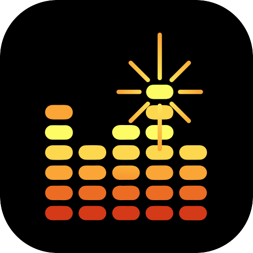

<h1>
  
  Spark Plug
</h1>

An Android recorder for instruments rather than for voice memos. Count yourself in at a tempo you
choose, play, and if the third bar goes wrong hit **Restart** without looking. Takes are written as
plain WAV files into a folder you pick, so they are on your phone's storage where you can find them
— not locked inside the app.

Early-stage — the recording and take-management half is built; the accompaniment half is not.

## Features

- **Two buttons that matter while recording** — full-width, thumb-height **Done** and **Restart**.
  Done ends the take and offers to save it; Restart wipes it and counts you back in.
- **Count-in** — off, one bar or two, at a tempo you set, with an accented downbeat. Borrowed from
  RubberRing: the whole count-in is one static `AudioTrack` buffer, so the clicks are
  sample-accurate rather than at the mercy of the scheduler.
- **A live waveform while you play** — the last eight seconds as a scrolling peak envelope, the
  same shape the player draws for a finished take. Scaled in decibels rather than linearly: a
  guitar picked at a sensible level sits around −20 dBFS, which drawn linearly is a tenth of the
  height and looks like a fault. Anything near full scale draws red, so clipping is visible as it
  happens.
- **Silent visual metronome** — one dot per beat under the buttons, the lit one walking the bar,
  driven from the sample count actually on disk. Position in the bar, not just the pulse: a glance
  tells you where you are, which is what you need to come back in after counting yourself out of a
  phrase. Silent by design — an audible click on a phone speaker ends up inside the take.
- **Listen before recording** *(optional, off)* — draws what the microphone hears before you press
  Record, so clipping and mic distance are settled while it still costs nothing. Nothing is
  written and the microphone is released the moment you leave the screen or start a take.
- **Your folder, your files** — pick any folder once (`Music/Recordings`, an SD card, a synced
  folder); takes land there as 44.1 kHz mono WAV. Browse it in the app, make sub-folders, rename,
  delete, share, play back.
- **Settings that stay out of the way** — tempo, count-in and the metronome sit on one row of the
  record screen as values you read rather than controls you wade through, since the usual case is
  checking them. Tempo opens to a slider, arrows, and a field you can type a number straight into.
- **Takes remember their tempo** — the bpm you played to is written into the WAV itself as a
  `LIST/INFO` comment, so it survives being copied to a computer. This is what the planned drum and
  bass tracks will lock to.
- **Recorded honestly** — the least-processed microphone source the device offers
  (`UNPROCESSED` → `VOICE_RECOGNITION` → `MIC`), and no filtering of any kind on the way to disk.
  The voice-recorder effects are all trained on speech: noise suppression hears a sustained note or
  a reverb tail as background and gates it, and automatic gain control hears a decaying chord as a
  talker going quiet and pushes the tail back up. Compression and limiting are absent for a
  different reason — clipping happens in the ADC, before software sees a sample, so a limiter
  cannot rescue it and would only cost you dynamics. Headroom is the fix.

## The player

Tapping a take's name in the library opens it in the player; the triangle beside the name plays it
where it stands, without leaving the list. The shape here is the same one the record screen drew
while you were playing — a take looks the same afterwards as it did being made.

The player draws the take's **waveform**, and that is the point of the screen. A seek bar tells you
where you are in a take. The shape tells you where the *playing* is — where the count-in ends,
where the chord you fluffed sits, where it trails off into you putting the guitar down — which is
what you are actually looking for when you re-open a take at all. Touch anywhere on it to seek, or
drag to scrub: the whole width is the control, because on a waveform the thing you want to reach is
a feature you can see rather than a fraction you can calculate.

What is drawn is a **peak envelope**, one peak per column rather than an average. An average of a
quiet passage and a loud one is a medium-loud passage, which is a lie about what is in the file;
peaks are what every editor draws and what the eye recognises as the shape of a take.

Two ways in, depending on the file:

- **WAV** is read straight through. It is already PCM, so the RIFF chunks are walked to `data` and
  the samples reduced as they stream past — starting a codec would cost more than the read.
- **Everything else** — an m4a from the stock recorder, an mp3 dropped in from a desktop — goes
  through `MediaExtractor` + `MediaCodec`. Whatever the device can play, it can draw. A folder of
  recordings collects more than this app puts in it, and a waveform is exactly as useful for those.

Either way the PCM is never kept: it arrives a buffer at a time, is folded into about 420 floats,
and is dropped. A five-minute take is 26 MB of samples and nothing worth holding on to. Decoding
stops as soon as the last column is filled, and is cancelled if you leave the screen, so a long
file that is mostly tail costs no more than the part that gets drawn.

Playback outlives the screen it started from. A **mini player** sits above the tabs wherever you
are, with the take's name, a play/stop toggle, a seek bar, and a close button — stop keeps the take
and your place in it, close puts it away. Without it, wandering off to the Record tab would leave a
take playing with nothing anywhere to stop it.

## Planned

- Foreground service, so a take survives the app going to the background.
- Trimming a take, now that there is a waveform to trim against.
- Auto drum and bass tracks under playback, in the spirit of the late Apple Music Memos — the tempo
  is already stored, and chord detection can come from CrystalBall's chromagram and template
  matching.

## Tech stack

- **Language:** Kotlin (Java 17 target)
- **UI:** Jetpack Compose (Canvas for the metronome and the level meter)
- **Build:** Android Gradle Plugin 9.2.1 + Gradle 9.5.1 (via wrapper)
- **SDK:** `minSdk` 26 · `compile`/`targetSdk` 36
- **Capture:** `AudioRecord` → raw PCM in the cache → WAV on save
- **Playback:** `MediaPlayer`; waveforms from `MediaExtractor` + `MediaCodec` (RIFF read directly)
- **Storage:** Storage Access Framework tree grant (`DocumentsContract`)
- **Async:** Kotlin Coroutines + Flow

No native code, no NDK, no GPL dependencies — as in RubberRing and Crystal Ball.

## Building

Requires a JDK (17+) and the Android SDK. Point the build at your SDK with a `local.properties` in
the project root (git-ignored):

```properties
sdk.dir=/path/to/Android/Sdk
```

Then:

```sh
./gradlew assembleDebug
```

The APK lands at `app/build/outputs/apk/debug/app-debug.apk`; sideload it to a device.

## Project layout

```
app/src/main/java/de/singular/recorder/
  MainActivity.kt        Compose entry point, tabs and drawer, permission and folder pickers
  RecorderViewModel.kt   app state: settings, folder tree, recording, playback
  Settings.kt            persisted preferences
  audio/
    AudioRecorder.kt     microphone -> PCM cache file; finish / restart / save; level monitoring
    Metronome.kt         count-in clicks (adapted from RubberRing)
    Wav.kt               RIFF header, with tempo in a LIST/INFO chunk
    Waveform.kt          WAV -> peak envelope, and the bucketing both paths share
    AudioDecoder.kt      everything else -> peak envelope, via MediaCodec
  storage/
    RecordingStore.kt    the granted folder: list, create, rename, delete, write
  ui/
    RecordScreen.kt      the take in progress
    LiveWaveform.kt      the scrolling input envelope, recording and listening
    LibraryScreen.kt     browsing the folder tree
    PlayerScreen.kt      one take, its waveform and its transport
    MiniPlayer.kt        the bar above the tabs, so playback is never orphaned
    VisualMetronome.kt   the beat dots and the count-in
    TabBar.kt            the compact bottom tabs
    SettingsScreen.kt · AboutScreen.kt · Common.kt · Theme.kt
```

## Known limitations

- Recording stops if the app leaves the foreground — Android takes the microphone away from
  background apps. A foreground service is the fix, and is planned.
- Mono only. Phone microphones are effectively mono; stereo would double the file size for nothing
  until there is an interface to record from.
- Waveforms are drawn from the whole file at a fixed ~420 columns. There is no zoom, which is fine
  for a take and would not be for an arrangement.
- The record colour is derived from the accent — red at the accent's own saturation and lightness.
  A red or orange accent would land on top of it and lose the distinction it exists to make.
